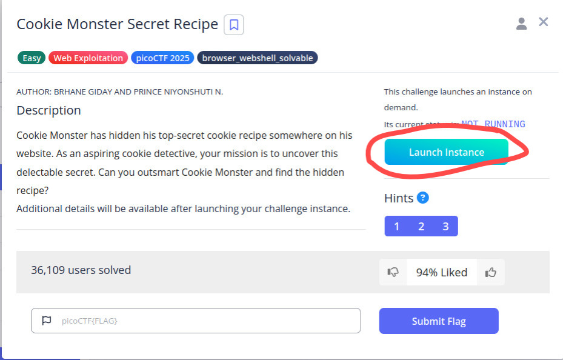
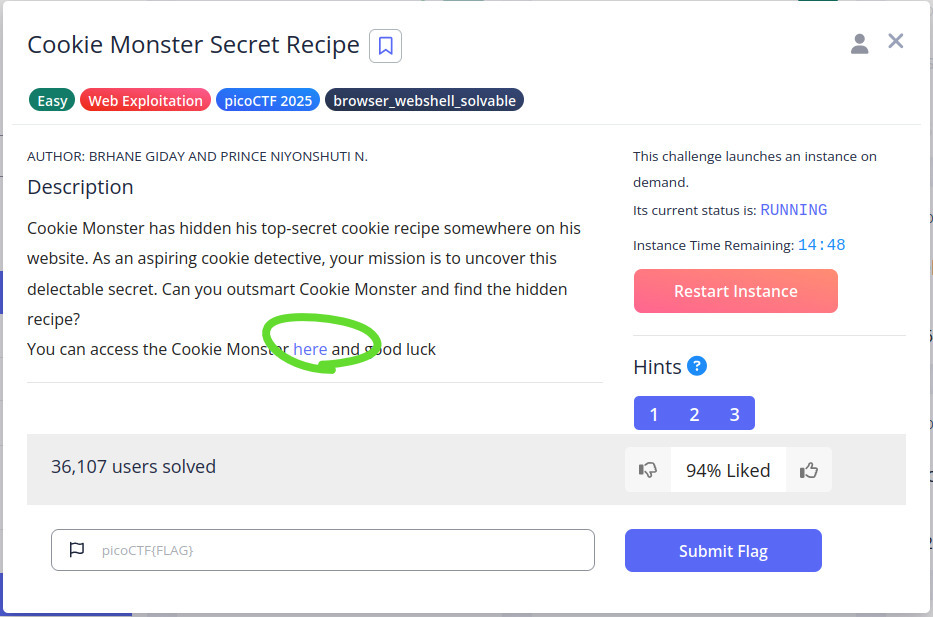
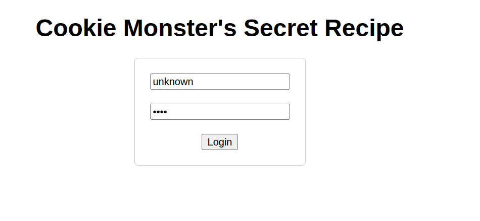
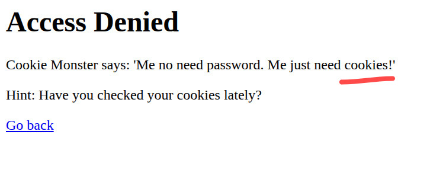
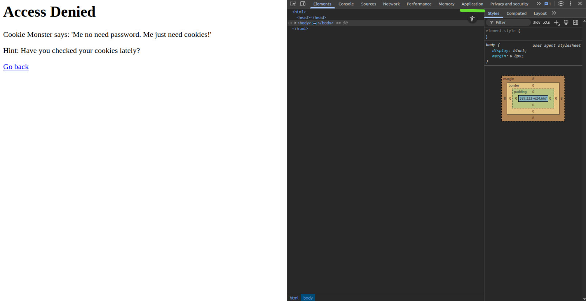
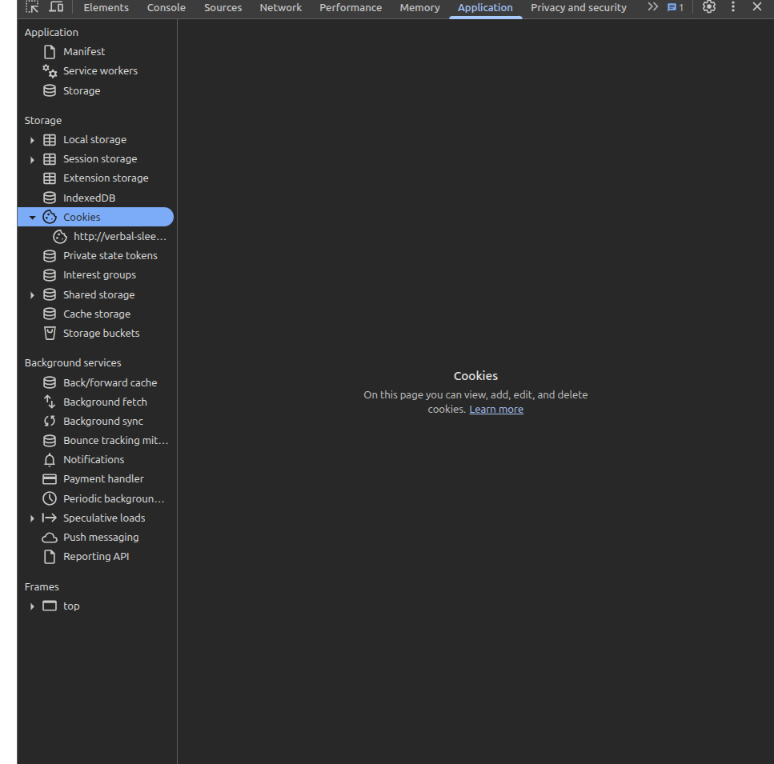
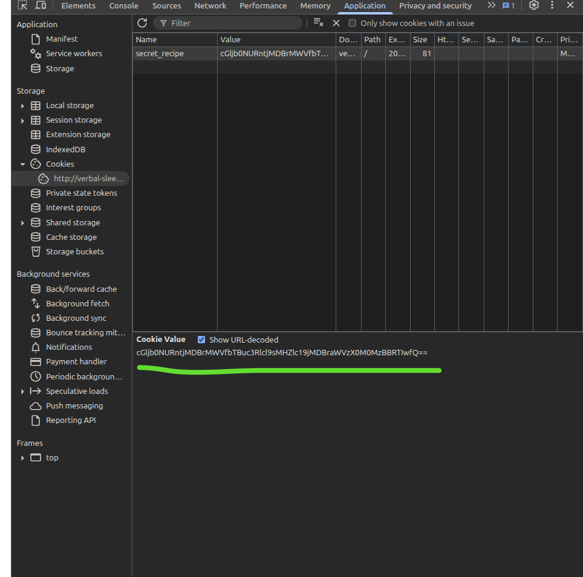
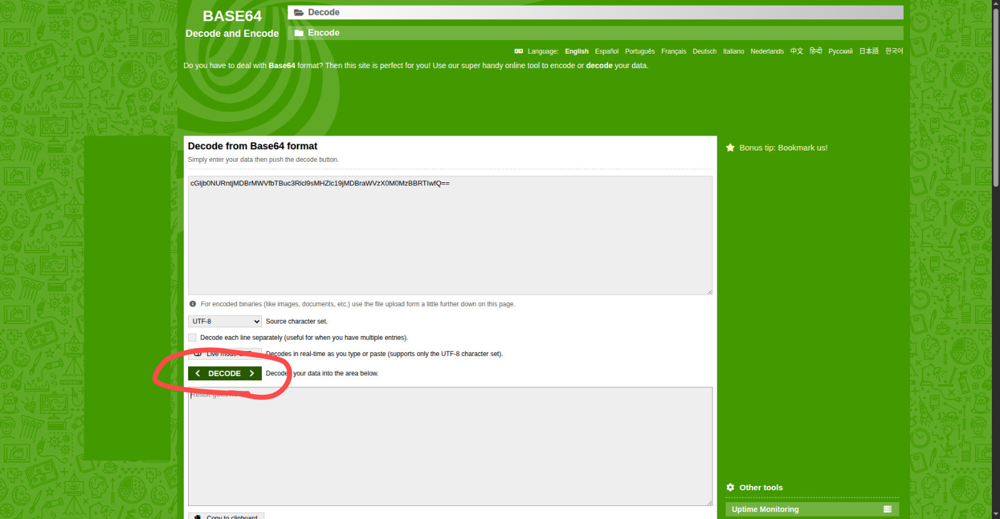
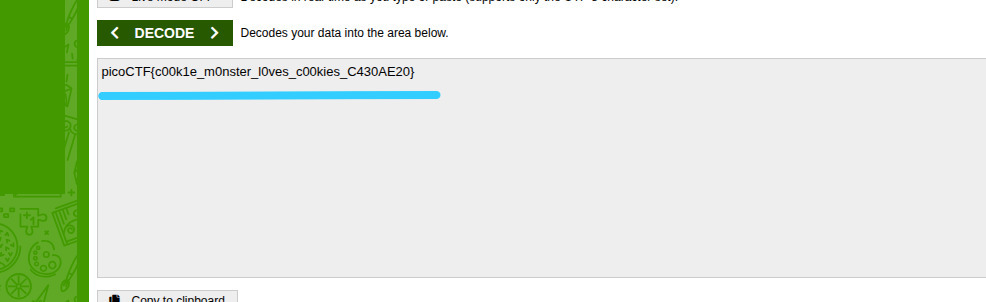
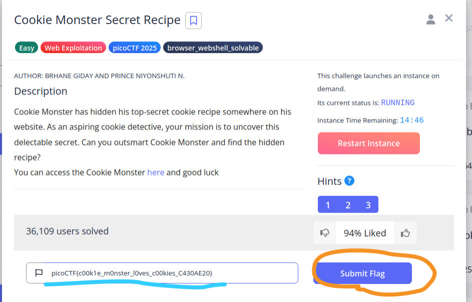

# Cookie Monster Secret Recipe  
**Type:** Web Exploitation / Cryptography  
**Challenge Link:** <https://play.picoctf.org/practice/challenge/469?category=1&page=1>

---

# 📝 Short Description

A **cookie** is a small piece of stored data used by websites to identify users, store sessions, and remember information.  
In this challenge, the cookie stored by the browser hides something important — the **flag**.

If you want to learn more about cookies, check this resource:  
🔗 <https://www.geeksforgeeks.org/computer-networks/cookies-network-security/>

---

# 🛠️ Tools Used

- A web browser with Developer Tools (Chrome/Firefox)
- Base64 decoder: <https://www.base64decode.org/>

---

# 🚀 Steps to Solve

## Direct CTF link
https://play.picoctf.org/practice/challenge/469?category=1&page=1

# 1️⃣ Start the Challenge Instance  
## Click **Launch Instance**.  

---

# 2️⃣ Open the local website 
## Click **here**.  

---

# 3️⃣ Login Page  
## I entered a random username and password just to continue.  

After logging in, the site displays a message:

> **Cookie Monster says: "Me no need password. Me just need cookies!"**

---

# 4️⃣ Open Developer Tools  

## To open Developer Tools in your browser, use any of the following:

- Press **F12**
- Press **Ctrl + Shift + I**
- Right-click → **Inspect**

---

# 5️⃣ Navigate to Cookies  

## Once DevTools is open:
  - Navigate to application tab and cookie section

---

# 6️⃣ Copy Cookie Value  

## Steps:
- Click the show url encoded

- Click on the cookie entry and copy the value shown.  

---

# 7️⃣ Decode the Cookie  

## The cookie value looks like **Base64** encoding.  
Go to:

🔗 <https://www.base64decode.org/>

Paste the cookie and click **Decode**.  

Copy it

## You should now see a readable flag.

---

# 8️⃣ Submit the Flag  

## Copy the decoded flag and paste it into the challenge input box.  

---

# 🎉 Final Notes

- Cookies often store session information and may contain important hints or even flags.
- If a cookie value looks encoded or random, try decoding it.
- Base64 is common in beginner CTF challenges.

---

## ✅ Final Result

> The decoded cookie contains the final flag. 🏁
